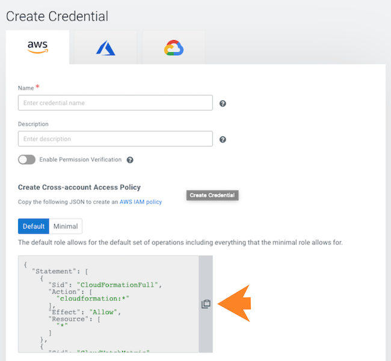

# AWS quickstart for CDP Public Cloud

## **Note**

This AWS onboarding quickstart is intended for simple CDP evaluation deployments only. It may not work for scenarios where AWS resources such as VPC, security group, storage accounts, and so on, are pre\-created or AWS accounts have restrictions in place.

The steps that we will perform are:

Step 0: Verify the AWS prerequisites

Step 1: Create a provisioning credential

Step 2: Register an AWS environment in CDP

*****
If you've reached the CDP landing page for the first time, you've come to the right place\! In this quickstart, we'll show you step\-by\-step how to connect CDP to your AWS account, so that you can begin to provision clusters and workloads.

To complete this quickstart, you'll need access to two things:

- The CDP console pictured above
- The AWS console

## Verify AWS cloud platform prerequisites

Before getting started with the AWS onboarding quickstart, review and acknowledge the following:

- This AWS onboarding quickstart is intended for simple CDP evaluation deployments only. It may not work for scenarios where AWS resources such as VPC, security group, storage accounts, and so on, are pre\-created or AWS accounts have restrictions in place.
- Users running the AWS onboarding quickstart should have:
    - AWS Administrator permissions on the AWS account that you would like to use for CDP.
    - Rights to create AWS resources required by CDP. See list of
    - CDP Admin role or Power User role in CDP subscription.
- This AWS onboarding quickstart uses a CloudFormation template that automatically creates the required resources such as buckets, IAM roles and policies, and so on.
- CDP Public Cloud relies on several AWS services that should be available and enabled in your region of choice. Verify if you have enough quota for each AWS service to set up CDP in your AWS account. See list of

If you have more complex requirements than those listed here, contact Cloudera Sales Team to help you with the CDP onboarding.

## Create a CDP credential

In the CDP console, the first step is to create a CDP credential. The CDP credential is the mechanism that allows CDP to create resources inside of your cloud account.

1. Log in to the CDP web interface.
2. From the CDP home screen, click the Management Console icon.
3. In the Management Console, select
4. Click Create Credential.
5. 
    Click the Copy icon to the right of the Create Cross\-account Access Policy text box.
6. 
    In a second browser tab, open the AWS Console and navigate to Identity and Access Management
7. You may get a warning related to using wildcards. You may ignore it and proceed to the next step.
    Click on the
8. Click
9. Click Review Policy.
10. Give the policy a unique name and a description.
11. Next, you create the required cross\-account role.
    Click Create Policy.
12. In the AWS console, navigate back to Identity and Access Management.
13. Click Roles
14. Under Select type of trusted entity, select Another AWS account.
15. Return to the CDP Management Console and copy the contents of the Service Manager Account ID field on the Credentials page.
16. In the AWS console, paste the Service Manager Account ID into the Account ID field.
17. Return to the CDP Management Console and copy the contents of the External ID field on the Credentials page.
18. In the AWS console, check the "Require external ID" options box, and then paste the External ID copied from CDP into the External ID field.
19. Click Permissions and select the checkbox next to the name of the
20. Click Next: Tags.
21. Click Next: Review.
22. Give the role a unique name and description, then click Create Role.
23. Still in the role page of the AWS console, search for the role you just created, and click on it.
24. 
    Copy the Role ARN at the top of the Summary page.
25. Return to the Credentials page in the CDP Management Console.
26. Give the CDP credential a name and description. The name can be any valid name.
27. 
    Now that you've created a cross\-account role, proceed to creating a CDP environment.
    Paste the

## Register a CDP environment

Before you register an environment, you'll want to create specific IAM roles and policies so that CDP can operate in a secure manner.

For background information, a description of what we're building and why can found [here](https://docs.cloudera.com/cdp-public-cloud/cloud/requirements-aws/topics/mc-idbroker-minimum-setup.html). For this quickstart, we'll use CloudFormation to set all of this up for you.

1. Download the CloudFormation provided template
2. In the AWS console, deploy the CloudFormation template:
    1. In AWS Services, search for
    2. Click Create Stack and select With new resources \(standard\).
    3. 
        Select Template is ready and then Upload a template file.
    4. Click Choose file and select the CloudFormation template that you downloaded.
    5. Click Next.
    6. Under
    7. For example:
        
        Make a note of the BackupLocationBase, LogsLocationBase, StorageLocationBase, and Prefix that you define. You will need them later.
        Under Parameters, complete the following fields:
    8. Click Next.
    9. At the Configure Stack Options page, click Next.
    10. 
        At the bottom of the Review page, under Capabilities, click the checkbox next to I acknowledge that AWS Cloudformation might create IAM resources with custom names, as that is exactly what we will be doing.
    11. Click Create Stack.
3. Still in the AWS console, create an SSH key in the region of your choice. If there is already an SSH key in your preferred region that you'd like to use, you can skip these steps.
    1. In AWS Services, search for
    2. In the top right corner, verify that you are in your preferred region.
    3. On the left hand navigation bar, choose Key Pairs.
    4. On the top right of the screen, select Create Key Pair.
    5. Provide a name. The name can be any valid name.
    6. Choose RSA type, and then choose the pem format.
    7. Click Create key pair.
4. Return to the CDP Management Console and navigate to Environments
5. Provide an environment name and description. The name can be any valid name.
6. Choose Amazon as the cloud provider.
7. Under Amazon Web Services Credential, choose the credential that you created earlier.
8. Click Next.
9. Under Data Lake Settings, give your new data lake a name. The name can be any valid name. Choose the latest data lake version.
10. For example:
    
    Under Data Access and Audit:Choose
11. For Data Lake Scale, choose Light Duty.
12. Click Next.
13. Under
14. Under Select Network, choose Create New Network.
15. Note
    By enabling private subnets you will not have SSH access to cluster nodes unless you have access to the VPC.
    **Create private subnets**
16. For example:
    
    Click the toggle button to enable
17. Under Security Access Settings, choose Create New Security Groups.
18. 
    Under SSH Settings, choose the SSH key you created earlier.For example:
19. Optionally, under Add Tags, provide any tags that you'd like the resources to be tagged with in your AWS account.
20. Click
21. Under Logs:
    1. Choose the Instance Profile titled
    2. For Logs Location Base, choose the
    3. For
22. 
    For example, using the parameters we defined earlier:
23. Click
